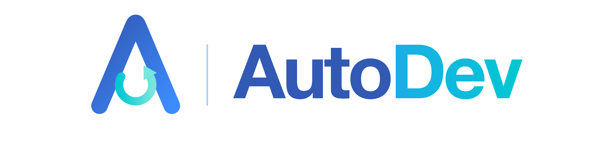
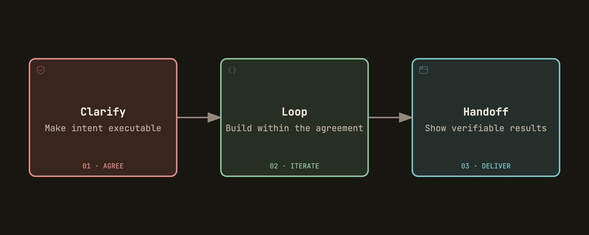
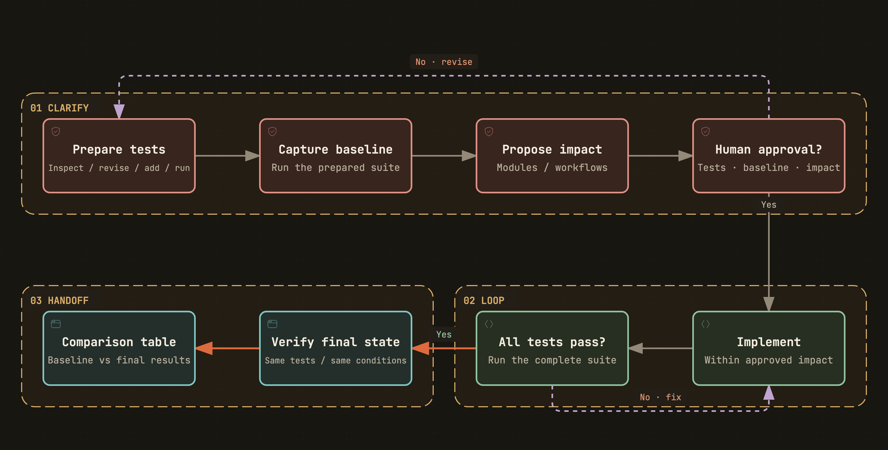
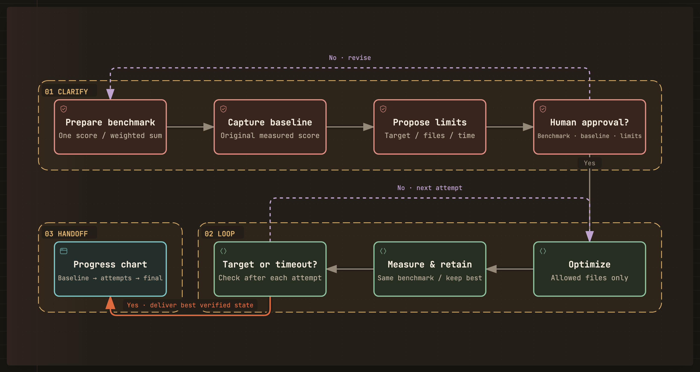

<p align="center">
  <strong>English</strong> · <a href="./README_ZH.md">简体中文</a>
</p>

<p align="center">
  
</p>



**autodev is a clarify-first Agent Skill: align with the human, implement within the agreement, and hand off visible evidence.**

```bash
npx skills add Momoyeyu/autodev -g
```

For **feature development** and **performance optimization**. It works with agents that load `SKILL.md` and reuses the target project's testing and measurement tools.

## Why autodev exists

Natural-language agreement does not guarantee shared understanding. An agent may implement the wrong behavior, change a workflow the human wanted to preserve, or optimize a number that does not represent the goal.

autodev exists to **align the agent and the human, reduce misunderstanding, and reduce rework**. Clarify turns intent into runnable, human-approved tests, a measured baseline, and explicit boundaries before implementation begins.

The intended benefit is better **quality, stability, and overall efficiency**, while improving the human's **understanding of the project and ability to take over**. Autonomous execution is useful only when both sides agree on what it should achieve.

## Verifiable & Measurable & Visible

| Principle | Meaning |
|---|---|
| **Verifiable** | The agreed test, exact command, and recorded outputs let the human check the result |
| **Measurable** | Baseline and final results use the same acceptance basis and comparable conditions |
| **Visible** | A feature ends with a comparison table; an optimization ends with a chart of its measured process |

These are requirements across the workflow, not three separate stages. Neither a passing test that misses the intent nor an attractive chart built from invented data is evidence of success.

## How it works

**User input → Clarify → Loop → Handoff.** User input triggers the workflow; the three working stages are shared, while their scenario-specific details differ.

| Stage | Feature development | Performance optimization |
|---|---|---|
| **Clarify** | Confirm impact; co-create runnable tests until approved; record baseline | Agree on one runnable numeric test; record baseline; confirm target, editable files, and time budget |
| **Loop** | Develop until all agreed tests pass | Optimize until the target is met or time expires |
| **Handoff** | One table comparing baseline and final test results | One chart showing baseline, optimization attempts, and the final result |

Clarify is not just a conversation. Inspecting code, maintaining tests, trial runs, and baseline measurement are part of establishing the agreement. Loop implements that agreement rather than deciding what success means along the way.

### Feature development



[Diagram source](docs/diagrams/autodev.development.json)

Start at the upper left with the feature request; follow the solid arrows across Clarify, down into Loop, and back toward Handoff. Dashed arrows are feedback cycles. Agree explicitly whether modules may be added or removed and whether existing workflows may change.

Test maintenance belongs **inside the human-in-the-loop review**, not after test approval. Keep still-relevant coverage and explain why outdated expectations changed. Approval concerns runnable tests, not just a test plan.

“Can execute” does not mean “already passes”: the missing feature may fail during preparation and baseline. Broken setup is not useful evidence. Record the formal baseline after approval, before feature implementation; do not count removal of obsolete tests as a development gain.

### Performance optimization



[Diagram source](docs/diagrams/autodev.optimization.json)

**One test, one score:** agree on an executable benchmark or a fixed weighted sum. Follow the solid arrows from test preparation through baseline and limits; the dashed paths repeat review or optimization. Loop uses **do-while** order: optimize, measure and retain the best verified state, then check the target and deadline. Repeat only if neither exit condition holds. Bound each run by the remaining wall-clock budget.

Agree on the workload, unit, direction, measurement method, and any weights or normalization before baseline. Multiple benchmark components still produce **one score**, not separate optimization targets. Do not change the ruler during Loop.

Retain the best verified candidate and record every attempt, including rejections and failures, so the chart describes what actually happened. A timeout ends the loop but does not imply the target was met. If baseline already meets the target or no improvement is verified, show that honestly rather than inventing a trajectory.

Reuse decisions already supplied by the human. Do not impose a fixed question count, invent a convergence stop, or silently extend a time budget.

## What the human receives

| | Feature development | Performance optimization |
|---|---|---|
| **Required artifact** | One baseline/final comparison table | One chart of baseline → attempts → final result |
| **What it shows** | Outcomes of the same approved tests, including totals and unresolved failures | The one score over attempt order or time, target, retained result, and stopping outcome |
| **What makes it verifiable** | Test/source identities, raw results, and the rerun command | Benchmark/source identities, actual history, measurement conditions, and the rerun command |

Add concise notes about relevant changes, limitations, and where to continue. The human should be able to understand the result and take over without reconstructing the agent's decisions.

**The artifact choice is part of the contract:** a prose summary does not replace the feature table, and a table or a final number does not replace the optimization chart. The chart must show the recorded process, not only two favorable endpoints. Do not fabricate scores for failed or timed-out attempts.

If intent, test meaning, or permitted scope changes, return to Clarify and establish a comparable new baseline. Do not splice results from different tests into a single improvement claim.

## Get started

Install the skill with the command above, then describe the task normally:

```text
Add CSV export for the filtered transaction list.
```

```text
Bring API p95 latency below 200 ms. Limit implementation changes to src/api/ and use a 20-minute optimization budget.
```

The first request starts with architecture/workflow alignment and collaborative test preparation. The second starts with benchmark agreement and baseline measurement; supplied limits are reused rather than asked for again.

## Skill structure

| File | Load when |
|---|---|
| [`autodev/SKILL.md`](autodev/SKILL.md) | At entry: purpose, principles, scenarios, and the three-stage contract |
| [`references/clarify.md`](autodev/references/clarify.md) | Starting Clarify or revisiting an agreement |
| [`references/clarify-development.md`](autodev/references/clarify-development.md) | Clarifying a feature request |
| [`references/clarify-optimization.md`](autodev/references/clarify-optimization.md) | Clarifying a performance goal |
| [`references/loop.md`](autodev/references/loop.md) | Starting Loop after agreement and baseline are ready |
| [`references/handoff.md`](autodev/references/handoff.md) | Preparing the required comparison table or process chart |

Read the current stage's shared rules and the applicable scenario only. Do not preload later stages or the other Clarify branch. Progressive disclosure is about providing detail when it is needed, even when a task eventually visits all three stages.

This repository distributes the skill, not a bundled test runner or evaluation suite. Tests are prepared with the human in the project where the skill is used. The README illustrations show the workflow itself, not example test results.

## Contributing

Keep the skill, bilingual READMEs, and diagram sources consistent. See [CONTRIBUTING.md](CONTRIBUTING.md) for diagram regeneration and verification, and [AGENTS.md](AGENTS.md) for repository conventions.

## License

[MIT](LICENSE)
