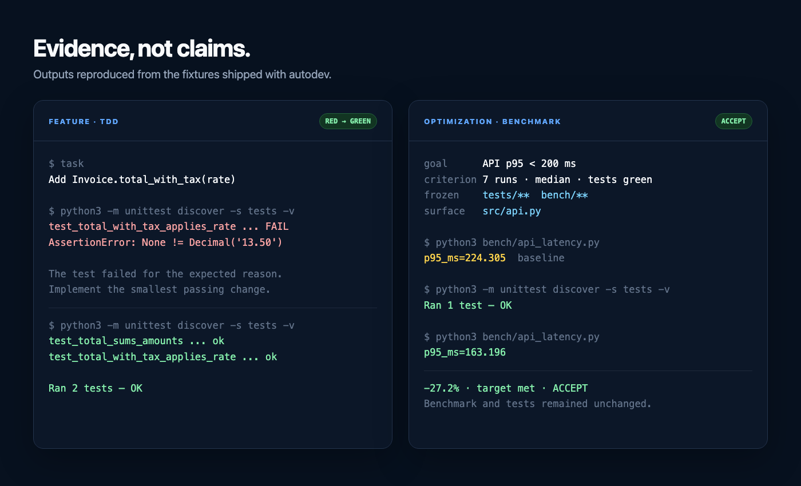

<p align="center">
  <strong>English</strong> · <a href="./README_ZH.md">简体中文</a>
</p>

# autodev

**autodev is an Agent Skill that makes coding agents prove their work: features must turn a failing test green, and optimizations must beat a frozen benchmark.**


```bash
npx skills add Momoyeyu/autodev -g
```

It works with Claude Code, Cursor, Codex CLI, OpenCode, and any agent that reads `SKILL.md`.

## Why autodev exists

Coding agents can produce changes faster than people can review them. The hard part is no longer getting code written; it is deciding whether the result deserves to stay.

Without a measurement protocol, the most important claims are impossible to verify:

| The agent says | What is missing |
|---|---|
| “The feature is done.” | A test that failed before the implementation and passes after it |
| “The page is faster.” | A baseline, a stable benchmark, and a measured noise floor |
| “This was the best attempt.” | A record of rejected ideas and the rule used to compare them |

autodev changes the deliverable. The agent's explanation is useful context, but it is no longer the evidence. The evidence is an artifact you can run again:

- a feature comes with a **RED → GREEN** test case;
- an optimization comes with a **before → after** measurement;
- every failed idea is **logged and restored** to the last accepted state instead of being quietly accumulated;
- tests, benchmarks, datasets, and other protected inputs are frozen so the agent cannot improve the score by changing the ruler.

The result is a ratchet: accepted code only moves in a direction that a script can verify.

## See it work

The repository ships small, dependency-free fixtures for each scenario below. The outputs in this image were reproduced from those fixtures, not written as illustrative numbers.



### 1. Add a feature

```text
Add Invoice.total_with_tax(rate).
```

autodev does not start by implementing the method. It first writes one focused test, runs it, and checks that it fails for the expected reason. Only then does it add the smallest passing implementation and run the whole suite.

| Checkpoint | Reproduced result |
|---|---|
| RED | `test_total_with_tax_applies_rate ... FAIL` |
| GREEN | both invoice tests pass |
| Evidence | the new test demonstrates the input, rate, and exact total |

This is the **development mode**: there is no attempt budget. The behavior is either implemented and protected by a test, or it is not done.

### 2. Optimize a measurable target

```text
Bring API p95 latency below 200 ms; use 7 runs and the median.
```

Before editing, autodev writes a contract:

```yaml
goal:      "API p95 latency below 200 ms"
criterion: "tests pass; 7 benchmark runs; compare medians"
frozen:    ["tests/**", "bench/**"]
surface:   ["src/api.py"]
budget:    "12 attempts or 20 minutes"
reset:     "restore src/api.py from the accepted commit"
```

The bundled fixture reproduced this outcome:

| | p95 | Tests | Verdict |
|---|---:|---|---|
| Baseline | 224.305 ms | pass | — |
| Attempt 1 | 163.196 ms | pass | **accept** |
| Net change | **−27.2%** | still green | target met |

A faster number alone is not enough. If the tests fail, or if the attempt edits the benchmark, the dataset, or another frozen input, autodev rejects the attempt and restores the last accepted state.

### 3. Stop when “better” has no meaning

```text
Make this code cleaner.
```

There is no runnable success criterion here, so autodev does not guess and does not edit. It asks for a measurable outcome—preserved behavior with lower complexity, higher coverage, a smaller binary, or another criterion that fits the repository.

The same rule blocks fake wins. For a throughput task, for example, autodev freezes the tests, benchmark, dataset, runner configuration, and lockfile. Reducing the dataset or loosening an assertion is a failed attempt even when the reported throughput rises.

## How it works


| Stage | Purpose | Complete when |
|---|---|---|
| **Define** | Turn the request into a falsifiable goal, executable gate, boundaries, budget, and reset | The contract is explicit and confirmed |
| **Anchor** | Freeze the measuring stick and establish a trustworthy starting state | RED is verified, or the baseline and noise are recorded |
| **Ratchet** | Measure every attempt, then accept it or restore the last accepted state | Every attempt has a mechanical verdict and log entry |
| **Prove** | Verify the accepted state from clean conditions and package the evidence | Tests, measurements, cost, and rejected attempts are reported |

Two established practices do the work:

1. **Test-Driven Development is the correctness gate.** New behavior starts with a failing test. Optimization never trades correctness for a better number.
2. **The ratchet is the progress gate.** The benchmark is fixed, the budget is explicit, and each attempt must be accepted or restored by a script. This mechanism is inspired by the accept/reject loop in [autoresearch](https://github.com/karpathy/autoresearch).

### Two modes, selected from the request

| Request | Success condition | Mode | Budget |
|---|---|---|---|
| add / implement / fix X | a relevant test goes from RED to GREEN | **development** | none |
| make X faster / smaller / cheaper | tests stay green and a metric beats the baseline beyond noise | **optimization** | required |
| add X and keep it under a limit | both conditions pass | **optimization** | required |
| make X “better” or “cleaner” | no executable criterion | **stop and ask** | — |

You never choose a mode manually. autodev infers it from the shape of the request and asks only for information that is genuinely missing. Optimization gets at most two questions—metric/target when ambiguous, then budget—and one confirmation of the complete contract.

## Get started

### Install

```bash
npx skills add Momoyeyu/autodev -g
```

Install only for Claude Code, globally and non-interactively:

```bash
npx -y skills add Momoyeyu/autodev --skill autodev -a claude-code -g --copy -y
```

Try it once without installing:

```bash
npx skills use Momoyeyu/autodev@autodev --agent claude-code
```

### Ask normally

No special prompt template is required:

```text
Implement CSV export for the filtered transaction list.
```

```text
Reduce CLI startup time by at least 5%. Use at most 10 attempts or 15 minutes.
```

For feature work, autodev starts with the failing test. For optimization, it presents the contract before spending the approved budget.

## Run the evaluation suite

The same scenarios used above are versioned under [`evals/`](evals/README.md):

```bash
python3 evals/run.py list
python3 evals/run.py run --case development-feature
python3 evals/run.py run
```

Each case runs in an isolated Git repository with the current skill installed as `.devin/skills/autodev`. Responses, transcripts, diffs, command output, and mutated workspaces are kept under the ignored `.autodev-evals/` directory for review.

After review, remove every generated artifact with one guarded command:

```bash
python3 evals/run.py clean
```

Validate the fixtures, runner, cleanup guard, corpus, and scorer without invoking a model:

```bash
python3 -m unittest discover -s tests -v
```

## What is in the skill

| File | Loaded when | Purpose |
|---|---|---|
| [`autodev/SKILL.md`](autodev/SKILL.md) | every autodev run | two modes, four stages, both gates, essential verdicts and safeguards, reference routing |
| [`references/gate.md`](autodev/references/gate.md) | before changing production code or tests | correctness gate: RED → GREEN → REFACTOR, rationalizations, completion checklist |
| [`references/contracts.md`](autodev/references/contracts.md) | during Define for optimization or contract-design questions | six contract fields, metric choice, frozen variables, benchmark construction |
| [`references/progress-gate.md`](autodev/references/progress-gate.md) | before Anchor in optimization | progress gate: measurement, Ratchet verdicts, scoped restore, log, stops, Prove evidence |
| [`references/testing-anti-patterns.md`](autodev/references/testing-anti-patterns.md) | only when adding or changing mocks, helpers, or test-only APIs | checks that tests exercise real behavior instead of their doubles |
| [`references/testing-examples.md`](autodev/references/testing-examples.md) | only when a TDD step needs an example | illustrative retry and bug-fix sequences; read the relevant section |

Load the core first, not the entire directory. Ordinary development adds the correctness gate; optimization also loads the contract and progress gate. Mock guidance and worked examples stay conditional. Every reference is linked directly from the core, so none requires a chain of document loads to discover.

The skill itself remains language- and framework-agnostic. It does not require Jest, pytest, or a custom runtime; it reuses the commands the target repository already trusts.

## Contributing

Behavior changes should come with a regression case in `evals/cases.json`. Keep the core skill compact, put conditional detail in `references/`, and keep the English and Chinese READMEs synchronized. See [`CONTRIBUTING.md`](CONTRIBUTING.md).

## License

[MIT](LICENSE)
