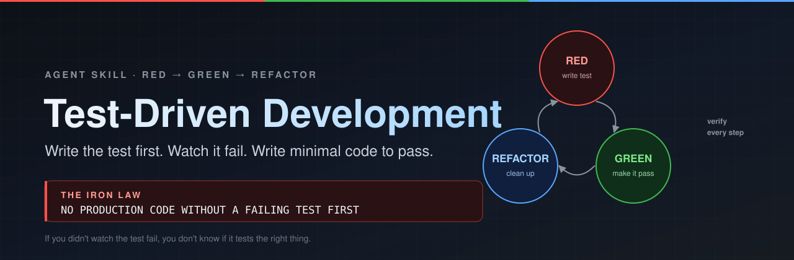
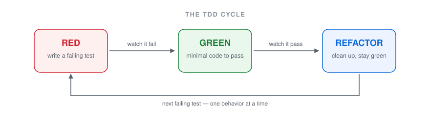

<p align="center">
  <strong>English</strong> · <a href="./README_ZH.md">简体中文</a>
</p>



# Test-Driven Development

**Make your agent earn every line of production code with a test that failed first.**

TDD is a single-folder Agent Skill for Claude Code, Cursor, Codex CLI, OpenCode, and any tool that reads `SKILL.md`. It ships the Iron Law, the full RED → GREEN → REFACTOR loop with mandatory verification gates, and pre-written answers to every excuse a model — or you — will reach for.

- **A hard gate, not a style tip** — no production code without a failing test that the agent actually watched fail
- **Both verifications are mandatory** — run the test and confirm it fails *for the expected reason*, then confirm it passes with the rest of the suite still green
- **Every rationalization pre-answered** — "too simple to test", "I'll test after", "I already tested it manually", "deleting X hours is wasteful" → each one mapped to its counter-argument
- **Mock hygiene built in** — a companion reference that catches tests asserting on mocks, test-only methods in production classes, and silently incomplete mocks
- **Zero dependencies, zero scripts** — plain Markdown that any agent can follow today


```bash
npx skills add Momoyeyu/test-driven-development -g
```

## The problem

Coding agents write plausible code fast, and plausible is not the same as correct. The default failure mode is well documented by anyone who has reviewed agent output:

1. The agent writes the implementation.
2. The agent writes tests that describe the implementation it just wrote.
3. The tests pass immediately, so nothing was ever proven — no edge case was discovered, no bug was caught, and the suite now locks in the current behavior, bugs included.

Tests written after the code answer *"what does this do?"*. Tests written first answer *"what should this do?"*. Only the second question finds the cases you forgot.

## The loop



| Step | What the agent does | Verification that cannot be skipped |
|---|---|---|
| **RED** | Writes one minimal test with a clear name, asserting one behavior, against real code | Runs it and confirms it fails **because the feature is missing** — not from a typo or an import error |
| **GREEN** | Writes the simplest code that passes that one test — no extra options, no speculative parameters | Runs it and confirms it passes, the rest of the suite still passes, and the output is clean |
| **REFACTOR** | Removes duplication, improves names, extracts helpers — behavior unchanged | Stays green through every edit |
| **Repeat** | Picks the next behavior and writes the next failing test | — |

The skill states the rule the loop exists to protect:

```
NO PRODUCTION CODE WITHOUT A FAILING TEST FIRST
```

Code written before its test gets deleted, not "kept as reference" and not "adapted while writing tests". That is the part agents skip when they are being helpful, so the skill names the shortcut explicitly and forbids it.

## Quick start

### 1. Install

```bash
npx skills add Momoyeyu/test-driven-development -g
```

Global, non-interactive, Claude Code only:

```bash
npx -y skills add Momoyeyu/test-driven-development --skill tdd -a claude-code -g --copy -y
```

Try it without installing:

```bash
npx skills use Momoyeyu/test-driven-development@tdd --agent claude-code
```

### 2. Ask for a feature or a bugfix

The skill is written to trigger on implementation work, so plain requests are enough:

```text
Add rate limiting to the /login endpoint — 5 attempts per minute per IP.
```

```text
Bug: submitting an empty email is accepted by the signup form. Fix it.
```

### 3. Watch the order of operations

A correct run looks like this, and it is the reason to install the skill rather than to prompt for TDD in the moment:

```text
RED       writes test "rejects empty email"          → npm test → FAIL: expected 'Email required', got undefined
GREEN     adds the trim() guard                      → npm test → PASS (all green)
REFACTOR  extracts shared field validation           → npm test → still PASS
```

If your agent's first move after the request is opening the implementation file, the skill is not installed — or it is being ignored, which is what the **Red Flags** section exists to catch.

## What's inside

| File | Role |
|---|---|
| [`tdd/SKILL.md`](tdd/SKILL.md) | The skill itself: when to use it, the Iron Law, the three phases with their verification gates, good-test criteria, the rationalization table, red flags, a worked bug-fix example, and a pre-completion checklist |
| [`tdd/testing-anti-patterns.md`](tdd/testing-anti-patterns.md) | Loaded when tests or mocks are being touched: five anti-patterns, each with the violation, why it is wrong, a gate function, and the fix |

## Why this holds up in practice

- **It refuses the "tests after" compromise.** The skill does not ask for more tests; it changes the order. Order is the whole mechanism — a test that never failed proves nothing.
- **It forces failure diagnosis.** "Test passes? You're testing existing behavior." "Test errors? Fix the error and re-run until it fails correctly." Two of the most common silent failures get an explicit instruction instead of a judgment call.
- **It answers pushback in the model's own register.** Models are good at producing reasonable-sounding justifications. The rationalization table meets each one with a shorter, harder answer.
- **It covers the second-order damage.** Passing tests over mocks are worse than no tests. The anti-pattern reference targets exactly the tests agents like to write.
- **It stays honest about scope.** Throwaway prototypes, generated code, and configuration files are listed as exceptions that require asking a human — not as loopholes.

## Red flags the skill tells the agent to stop on

- Code written before the test
- Tests added after implementation
- A test that passes the very first time it runs
- An inability to explain why the test failed
- "I already tested it manually"
- "Tests after achieve the same goal — it's spirit, not ritual"
- "Keep it as reference and write the tests first"
- "I already spent X hours, deleting it is wasteful"
- "TDD is dogmatic, I'm being pragmatic"
- "This case is different because…"

Each of these resolves to the same instruction: **delete the code and start over with TDD.**

## Common rationalizations, answered

| Excuse | What the skill answers |
|---|---|
| "Too simple to test" | Simple code breaks. The test takes 30 seconds. |
| "I'll test after" | Tests that pass immediately prove nothing. |
| "Already manually tested" | Ad-hoc is not systematic. No record, can't re-run, forgotten under pressure. |
| "Deleting X hours is wasteful" | Sunk cost. Keeping unverified code is the actual waste. |
| "Keep as reference, write tests first" | You will adapt it. That is testing after. Delete means delete. |
| "Need to explore first" | Fine — throw the exploration away and start with TDD. |
| "The test is hard to write" | Listen to it. Hard to test means hard to use. |
| "TDD will slow me down" | TDD is faster than debugging in production. |

The full table lives in [`tdd/SKILL.md`](tdd/SKILL.md).

## Works with

Any agent that supports the [Agent Skills specification](https://agentskills.io). Global install paths for the common ones:

| Agent | `--agent` | Global path |
|---|---|---|
| Claude Code | `claude-code` | `~/.claude/skills/` |
| Cursor | `cursor` | `~/.cursor/skills/` |
| Codex CLI | `codex` | `~/.codex/skills/` |
| OpenCode | `opencode` | `~/.config/opencode/skills/` |
| GitHub Copilot | `github-copilot` | `~/.copilot/skills/` |
| Gemini CLI | `gemini-cli` | `~/.gemini/skills/` |
| Windsurf | `windsurf` | `~/.codeium/windsurf/skills/` |
| Amp / Replit / universal | `universal` | `~/.config/agents/skills/` |

Manual install, if you would rather not use the CLI:

```bash
git clone --depth 1 https://github.com/Momoyeyu/test-driven-development.git /tmp/_tdd
cp -r /tmp/_tdd/tdd ~/.claude/skills/
rm -rf /tmp/_tdd
```

## Reference and scope

- [Skill definition](tdd/SKILL.md) · [Testing anti-patterns](tdd/testing-anti-patterns.md) · [Changelog](CHANGELOG.md) · [Contributing](CONTRIBUTING.md)

This skill covers test-first implementation workflow: features, bug fixes, refactors, and behavior changes. It is not a test-framework tutorial, not a mocking library guide, and not a coverage-target tool — it deliberately has no language or framework requirements so it applies wherever your agent writes code.

## License

[MIT](LICENSE) — free to use, modify, and distribute.

## Contributing

Issues and pull requests are welcome, especially real transcripts of the skill being ignored (or obeyed) by an agent. Start with the [contribution guide](CONTRIBUTING.md).

## Star History

<p align="center"><a href="https://star-history.com/#Momoyeyu/test-driven-development&Date">
  <picture>
    <source media="(prefers-color-scheme: dark)" srcset="https://api.star-history.com/svg?repos=Momoyeyu/test-driven-development&type=Date&theme=dark" />
    <source media="(prefers-color-scheme: light)" srcset="https://api.star-history.com/svg?repos=Momoyeyu/test-driven-development&type=Date" />
    
  </picture>
</a></p>
