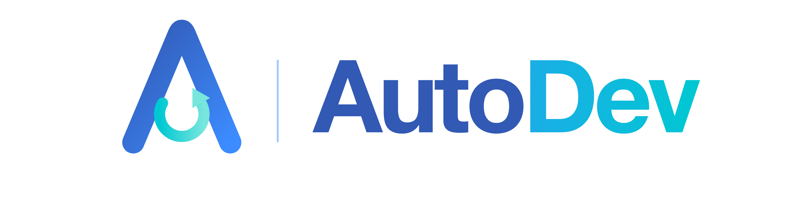
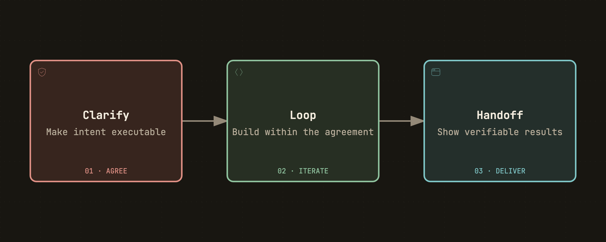
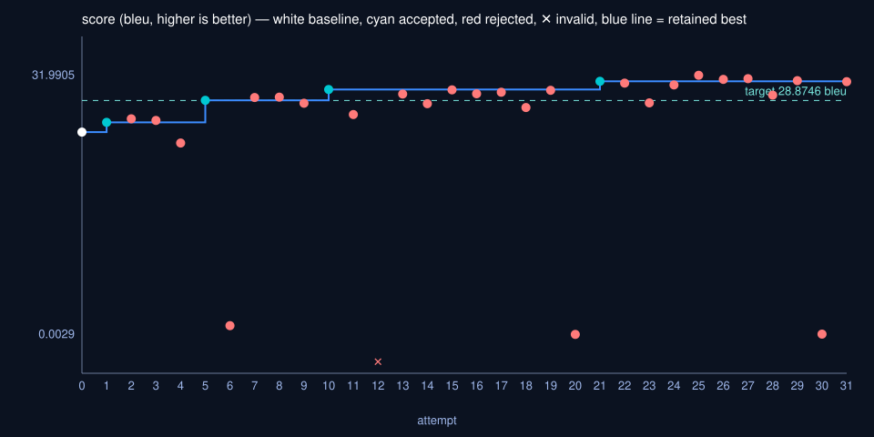
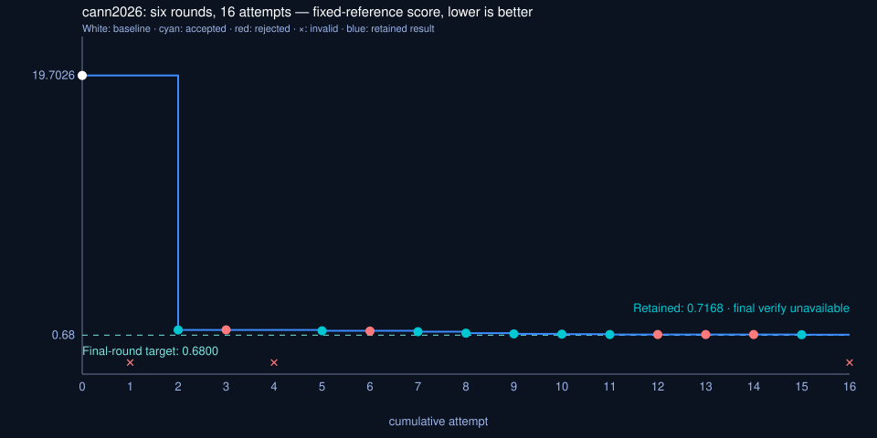
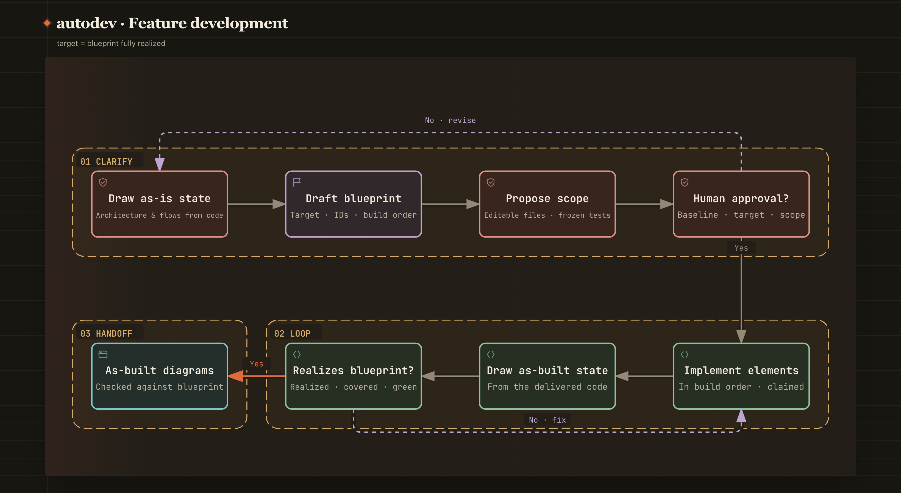
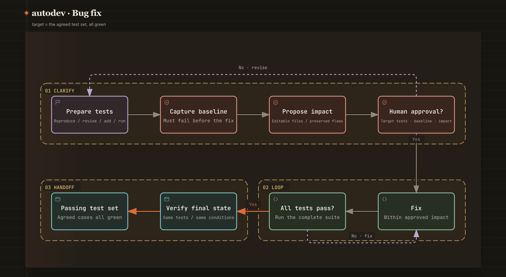
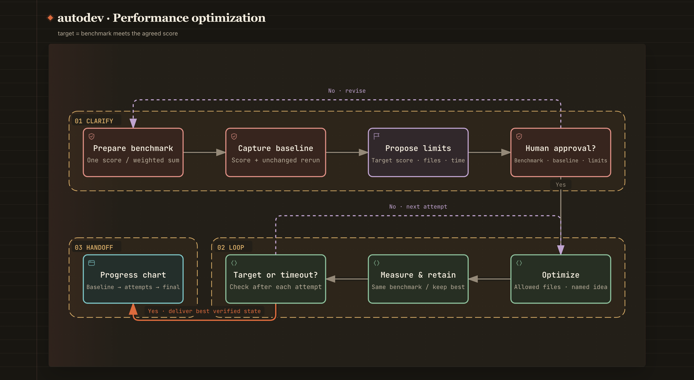

<p align="center">
  <strong>English</strong> · <a href="./README_ZH.md">简体中文</a>
</p>

<p align="center">
  
</p>



**autodev is a clarify-first Agent Skill: align with the human, implement within the agreement, and hand off visible evidence.**

```bash
npx skills add Momoyeyu/autodev -g
```

For **feature development**, **bug fixes**, and **performance optimization**. It works with agents that load `SKILL.md` and reuses the target project's existing tools.

## In practice

Two real optimization histories, drawn from recorded measurements using the skill's `report_chart` renderer.

**MoE Transformer — English→French translation (PyTorch, single RTX 4090D).** Target: BLEU ≥ 28.87 (the dense reference), baseline 24.97, only `src/train.py` editable, a fixed wall-clock budget per run. Re-running the benchmark on the unchanged source moved the score by 0.62, so the improvement margin was set at 0.8. Thirty-one attempts, thirty named routes, four retained — `top1-n4`, `batch-up`, `dropout-down`, `cosine-sched` — reached 31.25; the verify re-run scored 30.91. The other routes (torch.compile, EMA, fused AdamW, capacity and depth variants…) all measured under the margin and were rolled back.



**cann2026 — rotary position embedding kernel (AscendC, CANN 9.0).** Six rounds on one editable kernel file, shown as one continuous history: attempts 1–16 follow the initial baseline at 0. All scores are recomputed from the 15 per-case raw latencies against the same fixed reference vector used in rounds 3–6, giving one shared y axis from 19.7026 to the retained 0.7168. Historical accept/reject decisions are preserved; baseline remeasurements are not counted as attempts. The dashed line marks the final round's target, 0.680, not a target shared by all six rounds. Four rounds met their own targets; rounds 2 and 6 did not. In round 6, three ideas measured under the keep margin, one attempt failed to compile and was rolled back invalid, and the retained contiguous-token change scored 0.7168 against a 0.680 target; the final verify then hit a judge-service outage, which the report records as an outage, not a number.



## Why autodev exists

Natural-language agreement does not guarantee shared understanding. An agent may implement the wrong behavior, change a workflow the human wanted to preserve, or optimize a number that does not represent the goal.

autodev exists to **align the agent and the human, reduce misunderstanding, and reduce rework**. Clarify turns intent into a human-approved **target** — a blueprint, a passing test set, or a benchmark threshold — plus a recorded baseline and explicit boundaries before implementation begins.

The intended benefit is better **quality, stability, and overall efficiency**, while improving the human's **understanding of the project and ability to take over**. Autonomous execution is useful only when both sides agree on what it should achieve.

## Verifiable & Measurable & Visible

| Principle | Meaning |
|---|---|
| **Verifiable** | The agreed target, exact commands, and recorded outputs let the human check the result |
| **Measurable** | Baseline and final results use the same acceptance basis and comparable conditions |
| **Visible** | A feature ends with as-built diagrams, a bug fix with the passing test set, an optimization with a chart of its measured process |

These are requirements across the workflow, not three separate stages. Neither a passing test that misses the intent nor an attractive chart built from invented data is evidence of success.

## How it works

**User input → Clarify → Loop → Handoff.** User input triggers the workflow; the three working stages are shared, while their scenario-specific details differ.

| Stage | Feature development | Bug fix | Performance optimization |
|---|---|---|---|
| **Clarify** | Draw as-is diagrams; draft the blueprint; propose scope; the human reviews the whole pass | Prepare runnable tests; record baseline; propose impact; the human reviews the whole pass | Prepare one runnable benchmark; record baseline; propose target, editable files, and time budget; the human reviews the whole pass |
| **Loop** | Implement until the as-built state realizes the blueprint and checks stay green | Fix until all agreed tests pass | Optimize until the target is met or time expires |
| **Handoff** | As-built diagrams checked against the blueprint | The agreed test set passing | One chart showing baseline, optimization attempts, and the final result |

Clarify is not just a conversation. Inspecting code, drawing diagrams, maintaining tests, trial runs, and baseline measurement are part of establishing the agreement. The human-in-the-loop cycle wraps the **whole Clarify pass**: the agent prepares the target artifact, records baseline, and proposes the scope, then the human reviews all of it once and decides whether to revise or enter Loop. Loop implements that agreement rather than deciding what success means along the way. It runs in a dedicated git worktree and branch so the user's checkout is never touched; every attempt is a commit, a rejected optimization attempt is reset to the best commit, and Handoff merges the branch back.

### Feature development



Feature work is driven by a **blueprint**. One Clarify pass is: draw the as-is architecture and flow diagrams from the actual code (the baseline); draft the to-be blueprint as diagram JSON with stable element IDs and their build dependencies; then propose the editable scope, including whether existing tests stay frozen. The judge turns the dependencies into a **build order** — which elements come first, which can wait — and refuses a blueprint whose IDs all exist already in the as-is picture, since copying the starting state would then pass.

The human reviews the **whole pass at once** — as-is picture, blueprint with its build order, and proposed scope — and either sends it back for revision or approves it. Approval concerns an agreed design, not just a feature description.

Loop implements the blueprint element by element in a worktree, following the build order: every checkpoint names the elements it realizes, and a claim whose dependencies are not yet built is refused. When the code is done, the agent draws **as-built** diagrams from the delivered state at the agreed path; the judge reports `handoff` only when every element is realized, every element is covered there, the file is not the blueprint copied over, and the regression check is green. If the as-built state does not truly realize the blueprint, the development is wrong — keep looping instead of exiting. Handoff opens a self-contained `handoff.html` with blueprint and as-built side by side, the commit that realized each element, and a dependency graph colored by progress, so the human can see the target and what was actually built.

### Bug fix



A bug report usually names the concrete failing case, which makes the target easy to pin down: **a passing test set**. One Clarify pass is: write the reproduction test that must fail on the unchanged source; query, revise, and add regression tests; run the set for the baseline; then propose the impact.

The human reviews the **whole pass at once** — runnable tests, baseline results, and proposed impact — and either sends it back for revision or approves it. “Can execute” does not mean “already passes”: the judge refuses a test set that already passes on the unchanged source, because a target that cannot fail before the fix proves nothing after it. Broken setup is not useful evidence either.

Loop fixes until every agreed test passes; the test files are frozen and hash-checked each round. Handoff delivers the passing test set — each agreed case shown green with its raw output — not just a claim that the bug is gone.

### Performance optimization



**One benchmark, one score:** an executable benchmark or a fixed weighted sum. Follow the solid arrows from benchmark preparation through baseline and proposed limits to one human review; the dashed paths repeat the Clarify pass or the optimization attempt. Loop uses **do-while** order: optimize, measure and retain the best verified state, then check the target and deadline. Repeat only if neither exit condition holds. Bound each run by the remaining wall-clock budget.

Fix the workload, unit, direction, measurement method, and any weights or normalization before baseline; the human confirms them together with the baseline and the limits. Multiple benchmark components still produce **one score**, not separate optimization targets. Do not change the ruler during Loop. The judge reruns the benchmark on the unchanged source and requires the gap to stay below the improvement margin, so measurement noise alone can never count as progress.

Retain the best verified candidate and record every attempt, including rejections and failures, so the chart describes what actually happened. Each attempt names the idea it tests; an idea already refuted against the current best cannot be retried without saying what is new, and a new best reopens them all. A timeout ends the loop but does not imply the target was met. If baseline already meets the target or no improvement is verified, show that honestly rather than inventing a trajectory.

Reuse decisions already supplied by the human. Do not impose a fixed question count, invent a convergence stop, or silently extend a time budget.

## What the human receives

| | Feature development | Bug fix | Performance optimization |
|---|---|---|---|
| **Required artifact** | As-built architecture and flow diagrams against the blueprint | The agreed test set passing | One chart of baseline → attempts → final result |
| **What it shows** | The approved target design next to what was actually built, per element | Outcomes of the same approved tests, including totals and unresolved failures | The one score over attempt order or time, target, retained result, and stopping outcome |
| **What makes it verifiable** | Blueprint and as-built diagrams, element coverage, the commit behind each element, and the rerun command | Test/source identities, raw results, and the rerun command | Benchmark/source identities, actual history, the ideas tried and their outcomes, measurement conditions, and the rerun command |

`report` writes every scenario's deliverable into one self-contained `handoff.html` in the contract directory and prints the absolute path plus an `open` command; the handoff ends by opening that page or printing the path and command, not by a text claim. The file needs no tooling beyond a browser.

Add concise notes about relevant changes, limitations, and where to continue. The human should be able to understand the result and take over without reconstructing the agent's decisions.

**The artifact choice is part of the contract:** a prose summary does not replace the as-built diagrams or the passing test set, and a table or a final number does not replace the optimization chart. The chart must show the recorded process, not only two favorable endpoints. Do not fabricate scores for failed or timed-out attempts.

If intent, target meaning, or permitted scope changes, return to Clarify and establish a comparable new baseline. Do not splice results from different baselines into a single improvement claim. If the human is not satisfied with a handoff, the follow-up is a fresh autodev round — typically a bug fix against the concrete problem.

## Standing rules: the constitution

Some rules hold for every task in a project: paths that must never change, a check that must never break, a ceiling on how long an optimization may run. Write them once in `.autodev/constitution.json` and every round inherits them:

```json
{
  "frozen": ["migrations/", ".github/"],
  "guard_cmd": "pytest -q",
  "budget": {"default_minutes": 30, "max_minutes": 120, "reserve_minutes": 5}
}
```

The constitution is a floor. A round may freeze more or grant less time, but never loosen it; loosening means the human amends and commits the file. The guard runs before every attempt in every scenario; a failing guard invalidates the attempt, so an optimization cannot trade correctness for speed. An optional `.autodev/principles.md` carries prose conventions the agent reads during Clarify.

## Taking over a running loop

Everything a loop knows lives in its contract directory and branch, not in the conversation. A new session, or another agent, finds the `autodev/<task>` worktree, runs `status`, and gets the current position, whether any work is uncommitted or unjudged, what the log already rules out, and one line naming the next action.

## What is enforced, and by what

autodev is a protocol plus one small judge. The Markdown tells the agent what to do; `autodev/scripts/autodev_verify.py` (Python 3, standard library, installed with the skill) makes the parts that can be checked mechanically actually checked, every round, with raw output kept. Diagrams are plain JSON the agent edits; `autodev/scripts/autodev_render.py` renders them into self-contained HTML the human opens directly — the render is produced by the tool, so it cannot drift from the checked source.

| Guarantee | Provided by |
|---|---|
| Frozen files unchanged (tests, benchmark, blueprint, constitution), changes only inside the approved scope, the guard passing, time budget respected, score compared in the agreed direction with the agreed margin, rejected attempts rolled back with no residue, blueprint elements built in dependency order and covered by the as-built file, refuted routes not retried silently, every verdict logged with its raw output | `autodev_verify.py`: `init` in Clarify, `start`/`attempt`/`status` in Loop, `verify`/`report` in Handoff. `start` first proves the checks bite by editing a frozen file and adding an out-of-scope file and requiring both to be rejected. |
| Each target can fail: the bug-fix tests fail before the fix, benchmark noise stays below the margin, the blueprint adds elements the as-is picture lacks | `init`'s negative control, before the human reviews the pass |
| The blueprint is the right design, the tests measure the right thing, the proposed impact or limits are reasonable, as-built diagrams truly match the blueprint, route labels name distinct ideas honestly, the contract itself is approved | The agent's judgment where a check cannot be mechanical, and the human's single review of the whole Clarify pass |
| The artifact is read, the merged branch is accepted | The human at Handoff |

Installing the skill therefore does not by itself guarantee compliance; the contract directory it leaves behind does let the human check, round by round, whether the rules were executed rather than merely written. Nothing here is a runtime or a test framework: the judge only runs the project's own commands.

## Get started

Install the skill with the command above, then describe the task normally:

```text
Add CSV export for the filtered transaction list.
```

```text
CSV export drops rows containing commas in the customer name.
```

```text
Bring API p95 latency below 200 ms. Limit implementation changes to src/api/ and use a 20-minute optimization budget.
```

The first request starts with as-is diagrams and blueprint agreement. The second starts with a reproduction test that fails on the unchanged source. The third starts with benchmark agreement and baseline measurement; supplied limits are reused rather than asked for again.

## Skill structure

| File | Load when |
|---|---|
| [`autodev/SKILL.md`](autodev/SKILL.md) | At entry: purpose, principles, scenarios, and the three-stage contract |
| [`references/constitution.md`](autodev/references/constitution.md) | The project has `.autodev/`, or standing rules are wanted |
| [`references/clarify.md`](autodev/references/clarify.md) | Starting Clarify or revisiting an agreement |
| [`references/clarify-development.md`](autodev/references/clarify-development.md) | Clarifying a feature request (blueprint) |
| [`references/clarify-bugfix.md`](autodev/references/clarify-bugfix.md) | Clarifying a defect report (test set) |
| [`references/clarify-optimization.md`](autodev/references/clarify-optimization.md) | Clarifying a performance goal (benchmark) |
| [`references/loop.md`](autodev/references/loop.md) | Starting Loop after agreement and baseline are ready, or taking over a running loop |
| [`references/handoff.md`](autodev/references/handoff.md) | Preparing the required artifact |
| [`scripts/autodev_verify.py`](autodev/scripts/autodev_verify.py) | Run, not read: `init` in Clarify, `start`/`attempt`/`status` in Loop, `verify`/`report` in Handoff |

Read the current stage's shared rules and the applicable scenario only. Do not preload later stages or the other Clarify branch. Progressive disclosure is about providing detail when it is needed, even when a task eventually visits all three stages.

This repository distributes the skill and its judge script, not a test runner or evaluation suite. Targets are agreed with the human in the project where the skill is used; the judge only executes the agreed commands and records the verdicts. The workflow illustrations show the process itself; the case-study charts use recorded measurements and the skill's chart renderer, with the cross-round metric explained alongside the chart.

## Contributing

Keep the skill, bilingual READMEs, and diagram sources consistent. See [CONTRIBUTING.md](CONTRIBUTING.md) for diagram regeneration and verification, and [AGENTS.md](AGENTS.md) for repository conventions.

## License

[MIT](LICENSE)
