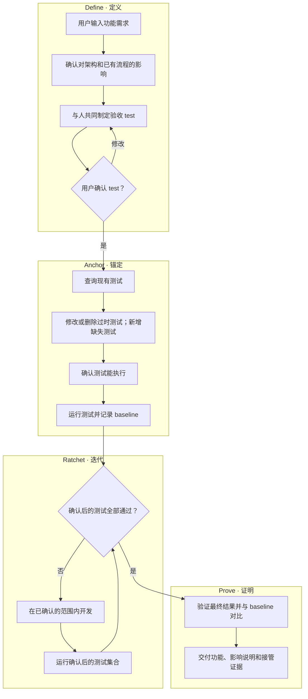
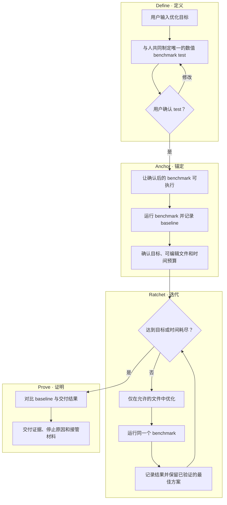

<p align="center">
  <a href="./README.md">English</a> · <strong>简体中文</strong>
</p>

# autodev

**先让 Agent 与人对齐，再进入实现。交付易验证、可度量、够直观的成果。**

```bash
npx skills add Momoyeyu/autodev -g
```

面向**功能开发**与**性能优化**的 Agent Skill。适用于能够加载 `SKILL.md` 的 Agent，复用目标项目已有的测试与 benchmark 工具。

## 为什么要做 autodev

自然语言上的同意，很容易被误认为双方已经理解一致。Agent 可能实现了错误的行为，改掉人希望保留的流程，或者优化了一个并不代表真实目标的数字。

autodev 在实现之前，把这些不确定性转化为双方共同确认的 test 定义。人确认怎样才算成功；Agent 记录 baseline，围绕确认后的 test 迭代，再展示最终差异。目的在于减少理解偏差和返工，而不只是增加自动写代码的时间。

希望获得的是更好的**质量、稳定性和综合效率**，以及一个能够**理解项目并接管工作**的人。

## Verifiable & measurable & visible

| 理念 | Agent 应交付什么 |
|---|---|
| **Verifiable · 易验证** | 人确认过的 test、准确的复现命令，以及真实的执行证据 |
| **Measurable · 可度量** | 可比较的 baseline 与最终结果：验收用例的状态，或一个数值 benchmark 分数 |
| **Visible · 够直观** | 易读的前后对比、对架构与流程的影响，以及足以接管工作的上下文 |

测试通过，只有在它代表人的真实意图时才有意义；分数变好，只有在它测量的是双方确认的工作时才有意义。漂亮的解释不能代替任何一项。

## 工作流程

**Define → Anchor → Ratchet → Prove** 同时组织工作流程与 skill 子文档。两种场景共用四个阶段，但不强行共用同一套决策顺序。

| 阶段 | 功能开发 | 性能优化 |
|---|---|---|
| **Define · 定义** | 确认架构与流程影响；与人反复制定验收 test，直到确认 | 与人反复制定唯一的数值 benchmark test，直到确认 |
| **Anchor · 锚定** | 整理现有测试，确认能执行，记录 baseline | 准备并运行 benchmark，记录 baseline，再确认目标、可编辑文件和时间预算 |
| **Ratchet · 迭代** | 开发并运行确认后的测试，直到全部通过 | 优化并测量，直到达到目标或时间耗尽 |
| **Prove · 证明** | 对比 baseline 与最终测试结果，交付功能和接管材料 | 对比 baseline 与最终分数，交付已验证的最佳结果与停止原因 |

### 功能开发



**先确认影响。** 明确功能对整体架构的影响，是否允许增加或减少模块，对已有流程有什么影响，以及是否允许修改这些流程。提出一个功能需求，不等于授权无限制地重新设计项目。

**确认 test，而不只是确认一段描述。** 与人一起审阅输入、操作、预期结果、边界和相关回归行为，持续修订，直到用户确认 test 定义。不限制必须问几轮问题。

**先维护测试，再建立基线。** 确认后查询已有测试，修改或删除过时的预期，新增缺失用例。保留仍有效的覆盖，并记录每项测试变更的原因。整理完成后才记录 baseline，确保前后使用同一套测试。

**能执行，不等于已经全部通过。** 测试运行器必须能够给出有意义的结果；尚未实现的功能可以在 baseline 中失败。损坏的运行环境不能充当基线证据。之后持续开发，直到确认后的测试全部通过，而不是修改验收标准来刷绿。

### 性能优化



**可量化：** test 是一个输出数值结果的 benchmark。使用之前，先确认测量对象、工作负载、单位、改善方向和测量方法。

**单一性：** 优化只能有一项 test。可以是一个 benchmark，也可以是多个 benchmark 的加权和，但最终必须得到一个分数。权重、归一化方式和聚合方法在 baseline 之前确认，迭代期间保持不变。各分项读数用于解释分数，不是独立的优化目标。

**先 baseline，再确认限制：** 运行确认后的 test 之后，明确：

- **优化目标：** 达到哪个分数阈值后可以提前退出。
- **修改范围：** 哪些实现文件可以修改；不能通过修改 benchmark、输入或评分规则刷榜。
- **时间预算：** 用实际经过的时间约束循环，包含测量，并预留最终验证时间。

复用用户已经明确给出的决定。持续优化，直到达到目标或时间耗尽，并保留已验证的最佳方案。不擅自增加收敛停止条件，也不偷偷延长预算。如果 baseline 已经达标，直接报告，不做无意义的修改。

超时是一个真实的停止原因，不代表目标已经达成。如果没有验证到提升，就如实交付这个结论和未变的最佳状态。

## 人最终拿到什么

| 交付物 | 功能开发 | 性能优化 |
|---|---|---|
| 已确认的定义 | 架构与流程变更权限、验收用例 | 唯一 benchmark 定义，以及根据 baseline 确认的目标、可编辑文件和时间预算 |
| 前后对比 | 同一用例 ID、同一测试版本的 baseline 与最终结果 | 同一工作负载、同一评分公式的 baseline 与最终分数 |
| 可运行的证据 | 命令、环境、原始结果和测试维护原因 | 命令、测量条件、原始样本和尝试记录 |
| 直观总结 | 用例矩阵，以及相关模块和流程变化 | 分数对比、是否达标、实际耗时，以及按需提供的趋势图 |
| 接管材料 | 修改后的入口、决策、限制和未完成事项 | 交付方案、被放弃的方法、限制和后续步骤 |

表格能清楚表达时，就使用表格；架构或流程变化适合用图说明，实测趋势适合按需画图。所有展示的结果都应能追溯到真实记录，而不是演示数字。

需求、允许的影响范围或 test 含义发生变化时，需要重新对齐并建立新 baseline。不能把这种变化藏进一次尝试，也不能与不同测试版本的结果混为一次提升。

## 快速开始

使用上面的命令安装 skill，然后像平常一样描述任务：

```text
为筛选后的交易列表增加 CSV 导出。
```

```text
把 API 的 p95 延迟降到 200 ms 以下。实现修改仅限 src/api/，优化时间预算为 20 分钟。
```

第一个需求先对齐架构与流程影响，再审阅 test。第二个需求先审阅 benchmark 并测量 baseline；已经给出的限制直接复用，不重复询问。

## Skill 结构

| 文件 | 何时加载 |
|---|---|
| [`autodev/SKILL.md`](autodev/SKILL.md) | 入口：目的、理念、场景选择和阶段路由 |
| [`references/define.md`](autodev/references/define.md) | 进入 Define：范围对齐与人确认的 test 定义 |
| [`references/anchor.md`](autodev/references/anchor.md) | 进入 Anchor：测试准备、baseline 和优化限制 |
| [`references/ratchet.md`](autodev/references/ratchet.md) | 进入 Ratchet：两种场景各自的循环和进展记录 |
| [`references/prove.md`](autodev/references/prove.md) | 进入 Prove：前后对比、直观证据和接管材料 |
| [`references/test-design.md`](autodev/references/test-design.md) | 仅在验收用例或复合 benchmark 需要设计细节时 |

渐进式披露以当前阶段为依据。不要一开始加载全部引用；进入某个阶段后，读取共用规则和当前场景的部分。最终会经过四个阶段，不意味着开始时就需要知道所有细节。

本仓库分发 skill，不附带测试运行器或评测套件。可执行测试属于使用 skill 的目标项目，由 Agent 与那个项目的负责人共同定义。

## 参与贡献

保持 skill、阶段文档和双语 README 的流程一致。审阅与验证方式见 [CONTRIBUTING.md](CONTRIBUTING.md)，仓库约定见 [AGENTS.md](AGENTS.md)。

## 许可

[MIT](LICENSE)
