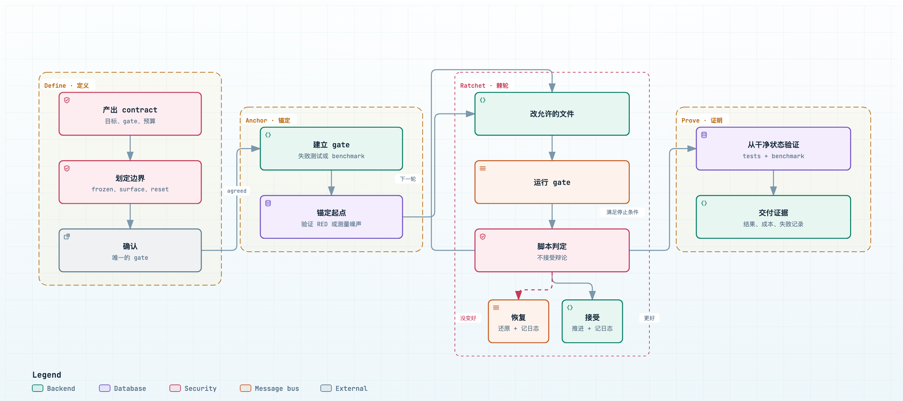
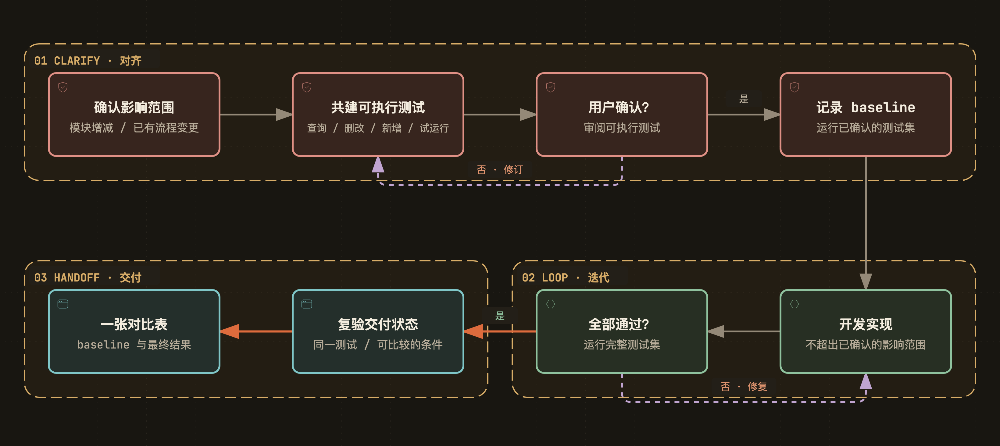
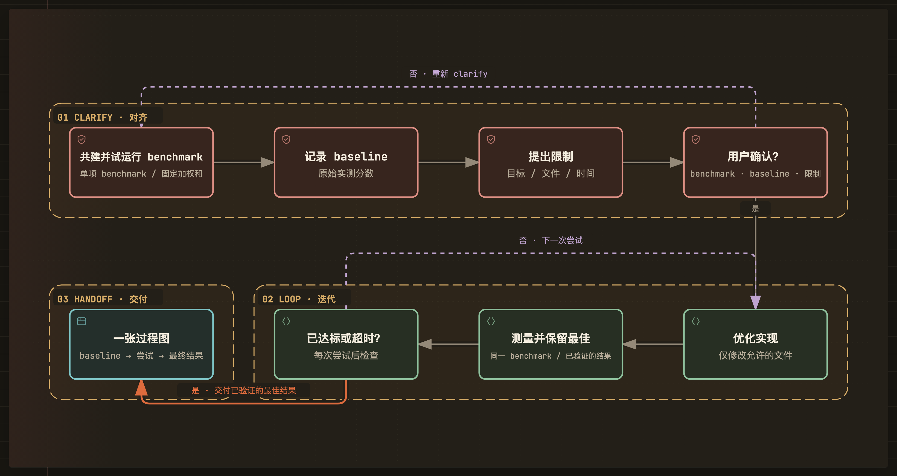

<p align="center">
  <a href="./README.md">English</a> · <strong>简体中文</strong>
</p>

<p align="center">
  
</p>



**autodev 是一个以 clarify 为核心的 Agent Skill：先与人对齐，在共识内执行，再交付直观的证据。**

```bash
npx skills add Momoyeyu/autodev -g
```

面向**功能开发**与**性能优化**。适用于能够加载 `SKILL.md` 的 Agent，复用目标项目已有的测试与测量工具。

## 为什么要做 autodev

自然语言上的同意，不保证双方已经理解一致。Agent 可能实现了错误的行为，改掉人希望保留的流程，或者优化了一个并不代表真实目标的数字。

autodev 的目的是**确保 Agent 与人对齐，降低理解偏差，减少返工次数**。Clarify 在实现之前，将意图转化为人确认过的可执行 test、实测 baseline 和明确的边界。

希望提高的是产出的**质量、稳定性和综合效率**，以及人对项目的**理解和接管能力**。只有双方对目标达成共识，自主执行才有价值。

## Verifiable & Measurable & Visible

| 理念 | 含义 |
|---|---|
| **Verifiable · 易验证** | 确认后的 test、准确的命令和实际执行记录，让人能够复验结果 |
| **Measurable · 可度量** | baseline 与最终结果使用相同验收依据和可比较的条件 |
| **Visible · 够直观** | 功能开发以一张对比表交付；性能优化以一张实测过程图交付 |

它们是贯穿流程的要求，不是三个独立阶段。偏离真实意图的测试即使通过，或者用虚构数据画出漂亮的图，都不能证明成功。

## 工作流程

**User input → Clarify → Loop → Handoff。** 用户输入触发流程；共用的工作阶段只有三个，具体规则按场景区分。

| 阶段 | 功能开发 | 性能优化 |
|---|---|---|
| **Clarify · 对齐** | 准备可执行 test；记录 baseline；提出影响范围；用户审阅整轮结果 | 准备唯一的可执行数值 test；记录 baseline；提出目标、可编辑文件和时间预算；用户审阅整轮结果 |
| **Loop · 迭代** | 开发直到确认后的 test 全部通过 | 优化直到达标或时间耗尽 |
| **Handoff · 交付** | 一张表，对比 baseline 与最终 test 结果 | 一张图，展示 baseline、优化尝试和最终结果 |

Clarify 不只是问问题。查代码、维护测试、试运行和测量 baseline，都是建立共识的一部分。human-in-the-loop 的循环套在**整个 Clarify 阶段外层**：agent 跑完一轮——准备 test、记录 baseline、提出范围——用户一次审阅全部结果，决定继续 clarify 还是进入 Loop。Loop 负责实现共识，而不是边写代码边重新解释成功标准。Loop 在独立的 git worktree 和专用分支上进行，不触碰用户自己的工作区；每次尝试都是一个 commit，优化中被拒绝的尝试直接 reset 回最佳 commit，Handoff 时把分支合并回用户分支。

### 功能开发



从左上角的功能需求出发，沿实线完成 Clarify，向下进入 Loop，再沿箭头回到 Handoff；虚线表示反馈循环。一轮 Clarify 是：查询、删改、新增并试运行 test；运行得到 baseline；再提出影响范围，明确是否允许增减模块、是否允许修改已有流程。

用户**一次审阅整轮结果**——可执行 test、baseline 结果和提出的影响范围——然后决定退回修订还是确认进入 Loop。先看到 baseline 再做决定，才能判断 test 量的是不是对的东西。保留仍有效的覆盖，说明过时期望为何被修改。用户确认的是可执行 test，而不只是测试计划。

“能执行”不等于“已经全部通过”：尚未实现的功能可以在准备和 baseline 阶段失败；损坏的运行环境不是有效证据。baseline 在功能实现之前记录，不能把删除过时测试算作开发收益。

### 性能优化



**一项 test、一个分数：** 可执行的 benchmark 或固定加权和。沿实线从测试准备走到 baseline、提出限制，再到一次用户确认；虚线表示重做一轮 Clarify 或再做一次优化尝试。Loop 采用 **do-while** 顺序：先优化、测量并保留已验证的最佳结果，再判断是否达标或时间耗尽；均未满足才继续下一轮。每次运行仍受剩余时间预算约束。

工作负载、单位、改善方向、测量方法，以及可能涉及的权重和归一化方式，都在 baseline 之前固定，由用户连同 baseline 和限制一并确认。多个 benchmark 分项仍只产生**一个分数**，不是多个独立优化目标。Loop 中不能换尺子。

保留已验证的最佳方案，记录每次尝试，包括被拒绝和失败的尝试，让图展示真实过程。超时结束循环，不代表目标达成。如果 baseline 已达标，或者没有验证到提升，就如实展示，不虚构优化轨迹。

复用用户已经明确给出的决定。不限制必须问几轮问题，不擅自增加收敛停止条件，也不偷偷延长时间预算。

## 人最终拿到什么

| | 功能开发 | 性能优化 |
|---|---|---|
| **必需产物** | 一张 baseline／最终结果对比表 | 一张 baseline → 尝试 → 最终结果的过程图 |
| **展示内容** | 同一套确认后的 test 的结果，包含汇总和未解决失败 | 唯一分数随尝试次数或时间的变化、目标、保留的结果和停止状态 |
| **复验依据** | 测试与源码版本、原始结果、重跑命令 | benchmark 与源码版本、真实历史、测量条件、重跑命令 |

附上必要的变更、限制和后续入口说明即可。人应该能够理解结果并接管，而不必重新推导 Agent 做过的决定。

**产物形式是约定的一部分：** 文字总结不能代替功能对比表；表格或一个最终数字不能代替优化过程图。图必须展示记录下来的过程，而不只是两个好看的端点。失败或超时的尝试不能被伪造为某个分数。

如果意图、test 含义或允许的范围发生变化，应回到 Clarify，并建立可比较的新 baseline。不能把不同测试的结果拼成一次提升。

## 约束由什么保障

autodev 是一套协议加一个小型裁决脚本。Markdown 告诉 agent 该做什么；随 skill 一起安装的 `autodev/scripts/autodev_verify.py`（Python 3 标准库）把其中能机械检查的部分变成每轮真正执行的检查，并保留原始输出。

| 保障项 | 由谁提供 |
|---|---|
| 冻结的测试／benchmark 文件未被改动、改动只落在允许范围内、时间预算被遵守、分数按约定方向和余量比较、被拒绝的尝试回滚无残留、每次裁决都带原始输出记录 | `autodev_verify.py`：Clarify 用 `init`，Loop 用 `start`／`attempt`／`status`，Handoff 用 `report`。`start` 会先故意改一个冻结文件、加一个范围外文件，要求两者都被拒绝，证明检查真的生效。 |
| test 量的是不是对的东西、提出的影响范围或限制是否合理、契约本身是否被认可 | 用户对整轮 Clarify 的一次审阅 |
| 表／图是否被看过、合并回来的分支是否被接受 | Handoff 时的用户 |

因此，安装 skill 本身并不保证 agent 一定遵守；但它留下的契约目录让人可以逐轮核对"规则是否真的被执行"，而不是"规则是否被写下来"。这里没有运行时框架，也不绑定测试工具：裁决脚本只调用项目自己的测试命令。

## 快速开始

使用上面的命令安装 skill，然后像平常一样描述任务：

```text
为筛选后的交易列表增加 CSV 导出。
```

```text
把 API 的 p95 延迟降到 200 ms 以下。实现修改仅限 src/api/，优化时间预算为 20 分钟。
```

第一个需求先对齐架构与流程影响，再共同准备测试。第二个需求先确认 benchmark 并测量 baseline；已经提供的限制直接复用，不重复询问。

## Skill 结构

| 文件 | 何时加载 |
|---|---|
| [`autodev/SKILL.md`](autodev/SKILL.md) | 入口：目的、理念、场景和三阶段约定 |
| [`references/clarify.md`](autodev/references/clarify.md) | 开始 Clarify 或重新对齐约定时 |
| [`references/clarify-development.md`](autodev/references/clarify-development.md) | 澄清功能需求时 |
| [`references/clarify-optimization.md`](autodev/references/clarify-optimization.md) | 澄清性能优化目标时 |
| [`references/loop.md`](autodev/references/loop.md) | 约定与 baseline 就绪，进入 Loop 时 |
| [`references/handoff.md`](autodev/references/handoff.md) | 准备必需的对比表或过程图时 |
| [`scripts/autodev_verify.py`](autodev/scripts/autodev_verify.py) | 运行而非阅读：Clarify 用 `init`，Loop 用 `start`／`attempt`／`status`，Handoff 用 `report` |

只读当前阶段的共用规则与对应场景，不要预加载后续阶段或另一条 Clarify 分支。渐进式披露的含义是需要时才提供细节，即使一个任务最终会经过全部三个阶段。

本仓库分发 skill 及其裁决脚本，不附带测试运行器或评测套件。测试由 Agent 与人共同在使用 skill 的目标项目中准备；脚本只执行约定的命令并记录裁决。README 配图只展示流程本身，不展示示例测试结果。

## 参与贡献

保持 skill、双语 README 和配图源文件一致。配图再生成与验证方式见 [CONTRIBUTING.md](CONTRIBUTING.md)，仓库约定见 [AGENTS.md](AGENTS.md)。

## 许可

[MIT](LICENSE)
