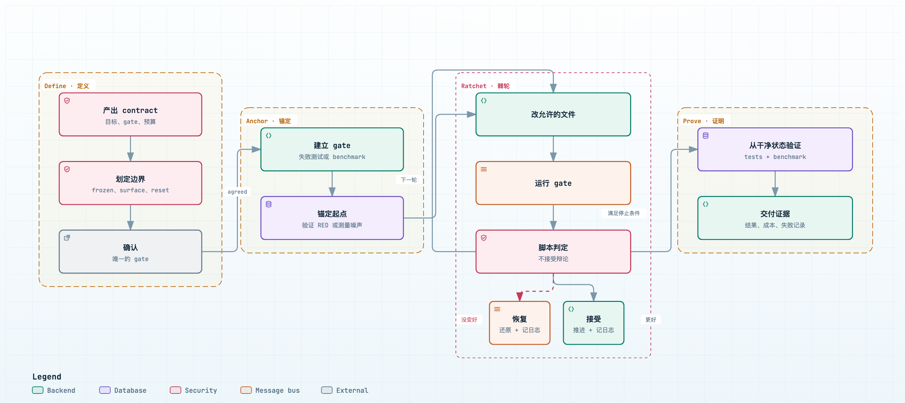
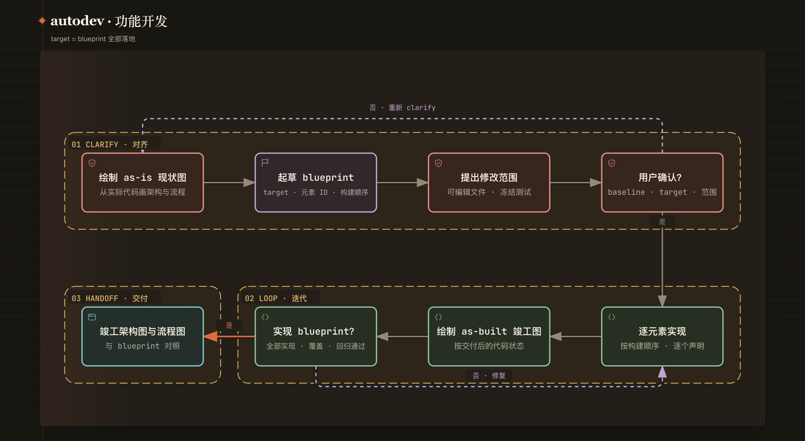
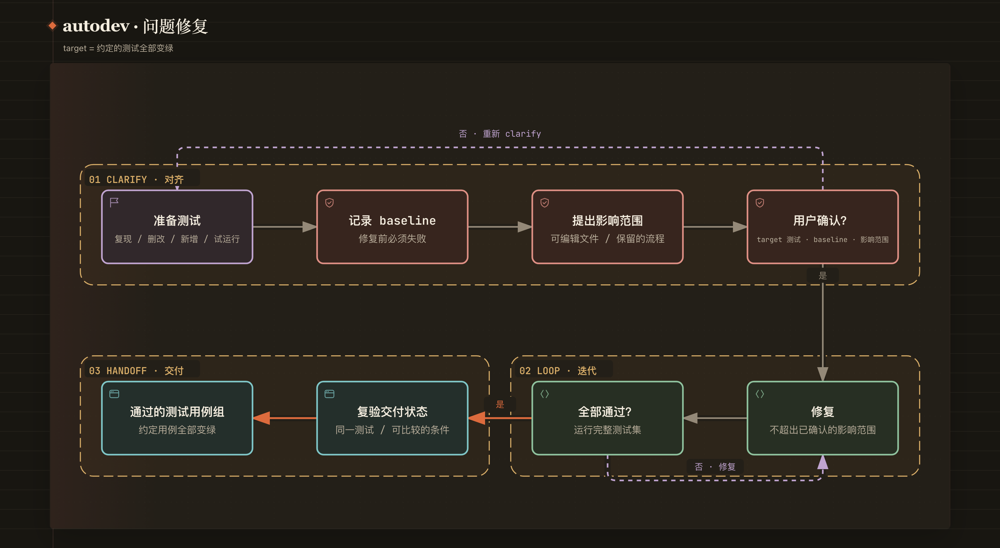
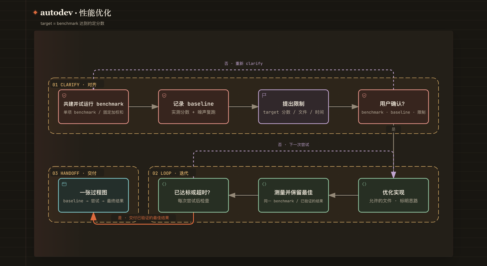

<p align="center">
  <a href="./README.md">English</a> · <strong>简体中文</strong>
</p>

<p align="center">
  
</p>



**autodev 是一个以 clarify 为核心的 Agent Skill：先与人对齐，在共识内执行，再交付直观的证据。**

```bash
npx skills add Momoyeyu/autodev -g
```

面向**功能开发**、**问题修复**与**性能优化**。适用于能够加载 `SKILL.md` 的 Agent，复用目标项目已有的工具。

## 实战案例

两个用本 skill 跑出的真实优化记录，基于实测数据、使用 skill 的 `report_chart` 绘图函数绘制。

**MoE Transformer —— 英译法翻译模型（PyTorch，单卡 RTX 4090D）。** 目标：BLEU ≥ 28.87（dense 参照值），baseline 24.97，只允许修改 `src/train.py`，每次运行固定墙钟预算。benchmark 在未改动的源码上复跑，同一份代码两次成绩相差 0.62，改进余量因此定为 0.8。31 次尝试、30 个思路标签、4 次被保留——`top1-n4`、`batch-up`、`dropout-down`、`cosine-sched`——达到 31.25；verify 复测 30.91。其余思路（torch.compile、EMA、fused AdamW、容量与层数变体等）测量全部低于余量，逐一回滚。


**cann2026 —— rotary position embedding kernel（AscendC，CANN 9.0）。** 对同一个 kernel 文件跑了六轮，图中是一条连续轨迹：初始 baseline 为第 0 点，16 次尝试接着编号。所有分数都从 15 个用例的原始耗时出发，按第 3–6 轮使用的同一组固定参考耗时重新计算，共用一条 y 轴，从 19.7026 到最终保留的 0.7168。保留当时的接受／拒绝判定，baseline 复测不计为新尝试。虚线标注最后一轮的目标 0.680，不代表六轮共用这个目标。四轮达到各自目标，第 2、6 轮未达标。第 6 轮里 3 个思路测量低于保留阈值，1 次尝试编译失败被判无效并回滚，保留的连续 token 分块优化拿到 0.7168（target ≤0.680）；最后 verify 撞上评测服务宕机，报告里记录的是宕机，不是一个编出来的分数。


## 为什么要做 autodev

自然语言上的同意，不保证双方已经理解一致。Agent 可能实现了错误的行为，改掉人希望保留的流程，或者优化了一个并不代表真实目标的数字。

autodev 的目的是**确保 Agent 与人对齐，降低理解偏差，减少返工次数**。Clarify 在实现之前，将意图转化为人确认过的 **target**——blueprint、通过的 test 组或 benchmark 目标值——加上实测 baseline 和明确的边界。

希望提高的是产出的**质量、稳定性和综合效率**，以及人对项目的**理解和接管能力**。只有双方对目标达成共识，自主执行才有价值。

## Verifiable & Measurable & Visible

| 理念 | 含义 |
|---|---|
| **Verifiable · 易验证** | 确认后的 target、准确的命令和实际执行记录，让人能够复验结果 |
| **Measurable · 可度量** | baseline 与最终结果使用相同验收依据和可比较的条件 |
| **Visible · 够直观** | 功能开发以竣工架构图与流程图交付；问题修复以全绿的测试用例组交付；性能优化以一张实测过程图交付 |

它们是贯穿流程的要求，不是三个独立阶段。偏离真实意图的测试即使通过，或者用虚构数据画出漂亮的图，都不能证明成功。

## 工作流程

**User input → Clarify → Loop → Handoff。** 用户输入触发流程；共用的工作阶段只有三个，具体规则按场景区分。

| 阶段 | 功能开发 | 问题修复 | 性能优化 |
|---|---|---|---|
| **Clarify · 对齐** | 绘制 as-is 图；起草 blueprint；提出修改范围；用户审阅整轮结果 | 准备可执行 test；记录 baseline；提出影响范围；用户审阅整轮结果 | 准备唯一的可执行 benchmark；记录 baseline；提出目标、可编辑文件和时间预算；用户审阅整轮结果 |
| **Loop · 迭代** | 实现 blueprint 的每个元素，直到竣工状态与之相符且回归检查通过 | 修复直到确认后的 test 全部通过 | 优化直到达标或时间耗尽 |
| **Handoff · 交付** | 按竣工状态绘制的架构图与流程图，与 blueprint 对照 | 全部通过的测试用例组 | 一张图，展示 baseline、优化尝试和最终结果 |

Clarify 不只是问问题。查代码、画图、维护测试、试运行和测量 baseline，都是建立共识的一部分。human-in-the-loop 的循环套在**整个 Clarify 阶段外层**：agent 跑完一轮——准备 target 产物、记录 baseline、提出范围——用户一次审阅全部结果，决定继续 clarify 还是进入 Loop。Loop 负责实现共识，而不是边写代码边重新解释成功标准。Loop 在独立的 git worktree 和专用分支上进行，不触碰用户自己的工作区；每次尝试都是一个 commit，优化中被拒绝的尝试直接 reset 回最佳 commit，Handoff 时把分支合并回用户分支。

### 功能开发



功能开发由 **blueprint** 驱动。一轮 Clarify 是：从实际代码绘制 as-is 架构图与流程图（即 baseline）；用 diagram JSON 起草 to-be 的 blueprint，每个元素带稳定 ID 并声明构建依赖；再提出可编辑范围，明确现有 test 默认冻结还是允许 blueprint 修改。裁决脚本把依赖换算成**构建顺序**——哪些元素先做、哪些可以后做；如果 blueprint 的元素 ID 在 as-is 图里全都已经存在，照抄现状就能通过检查，脚本会拒绝。

用户**一次审阅整轮结果**——as-is 图、带构建顺序的 blueprint 和提出的范围——然后决定退回修订还是确认进入 Loop。用户确认的是一份设计，而不只是功能描述。

Loop 在 worktree 里按构建顺序逐元素实现 blueprint：每个检查点都要声明本次实现了哪些元素，依赖还没建好的声明会被拒绝。代码完成后，agent 在约定路径按**竣工状态**绘制 as-built 图；裁决脚本只有在每个元素都已实现、都被 as-built 覆盖、该文件不是照抄的 blueprint、回归检查通过时才给出 `handoff`。如果竣工状态没有真正实现 blueprint，说明开发偏离——继续 loop 而不是退出。Handoff 打开一个自包含的 `handoff.html`，把 blueprint 与 as-built 并排展示，附上每个元素由哪个 commit 实现，以及按进度着色的依赖图，让人对照目标与实际成果。

### 问题修复



bug 报告通常会明确指出失败的具体 case，target 因此容易锁定：**一组通过的 test**。一轮 Clarify 是：先写在未改动源码上必须失败的复现测试；查询、删改、补充回归测试；运行整组得到 baseline；再提出影响范围。

用户**一次审阅整轮结果**——可执行 test、baseline 结果和提出的影响范围——然后决定退回修订还是确认进入 Loop。“能执行”不等于“已经全部通过”：如果测试集在未改动的源码上就已经全部通过，裁决脚本会拒绝——修复前不会失败的 target，修复后也证明不了什么。损坏的运行环境同样不是有效证据。

Loop 修复直到约定的 test 全部通过；测试文件逐轮冻结并校验哈希。Handoff 交付的是通过的测试用例组——每个约定用例都带原始输出显示为绿——而不只是"bug 已修"的说法。

### 性能优化



**一项 benchmark、一个分数：** 可执行的 benchmark 或固定加权和。沿实线从 benchmark 准备走到 baseline、提出限制，再到一次用户确认；虚线表示重做一轮 Clarify 或再做一次优化尝试。Loop 采用 **do-while** 顺序：先优化、测量并保留已验证的最佳结果，再判断是否达标或时间耗尽；均未满足才继续下一轮。每次运行仍受剩余时间预算约束。

工作负载、单位、改善方向、测量方法，以及可能涉及的权重和归一化方式，都在 baseline 之前固定，由用户连同 baseline 和限制一并确认。多个 benchmark 分项仍只产生**一个分数**，不是多个独立优化目标。Loop 中不能换尺子。裁决脚本会在未改动的源码上把 benchmark 再跑一遍，要求两次的差距小于改进余量，这样单纯的测量噪声永远不会被当成进步。

保留已验证的最佳方案，记录每次尝试，包括被拒绝和失败的尝试，让图展示真实过程。每次尝试都要标明测试的是哪个思路；在当前 best 下已被否定的思路，不说明新在哪里就不能重试；best 一旦刷新，这些思路全部重新开放。超时结束循环，不代表目标达成。如果 baseline 已达标，或者没有验证到提升，就如实展示，不虚构优化轨迹。

复用用户已经明确给出的决定。不限制必须问几轮问题，不擅自增加收敛停止条件，也不偷偷延长时间预算。

## 人最终拿到什么

| | 功能开发 | 问题修复 | 性能优化 |
|---|---|---|---|
| **必需产物** | 竣工架构图与流程图，与 blueprint 对照 | 全部通过的测试用例组 | 一张 baseline → 尝试 → 最终结果的过程图 |
| **展示内容** | 约定的目标设计与实际建成的状态逐元素对照 | 同一套确认后的 test 的结果，包含汇总和未解决失败 | 唯一分数随尝试次数或时间的变化、目标、保留的结果和停止状态 |
| **复验依据** | blueprint 与 as-built 图、元素覆盖表、每个元素对应的 commit、重跑命令 | 测试与源码版本、原始结果、重跑命令 | benchmark 与源码版本、真实历史、尝试过的思路及结果、测量条件、重跑命令 |

`report` 把三个场景的产物都写进契约目录里一个自包含的 `handoff.html`，并打印绝对路径和 `open` 命令；交付以打开这个页面（或原样给出路径与命令）收尾，而不是一句文字宣称。文件只需要浏览器，不依赖任何渲染工具。

附上必要的变更、限制和后续入口说明即可。人应该能够理解结果并接管，而不必重新推导 Agent 做过的决定。

**产物形式是约定的一部分：** 文字总结不能代替竣工图或全绿的测试用例组；表格或一个最终数字不能代替优化过程图。图必须展示记录下来的过程，而不只是两个好看的端点。失败或超时的尝试不能被伪造为某个分数。

如果意图、target 含义或允许的范围发生变化，应回到 Clarify，并建立可比较的新 baseline。不能把不同 baseline 的结果拼成一次提升。如果用户对交付不满意，做法是再起一轮 autodev——通常按问题修复场景针对具体问题——而不是续跑已结束的 loop。

## 长期规矩：项目宪法

有些规矩对项目里的每个任务都成立：永远不能动的路径、永远不能坏的检查、优化最多能跑多久。把它们写进 `.autodev/constitution.json` 一次，每一轮都会自动继承：

```json
{
  "frozen": ["migrations/", ".github/"],
  "guard_cmd": "pytest -q",
  "budget": {"default_minutes": 30, "max_minutes": 120, "reserve_minutes": 5}
}
```

宪法是底线。单轮可以冻结更多、给更少的时间，但不能放松；要放松，只能由人修改并提交这个文件。guard 在所有场景的每次尝试前都会运行，失败即判该次尝试无效，所以优化不能拿正确性换速度。可选的 `.autodev/principles.md` 写编码约定等文字原则，agent 在 Clarify 阶段阅读。

## 接管运行中的 loop

loop 知道的一切都在它的契约目录和分支里，而不在对话里。新的 session 或另一个 agent 找到 `autodev/<task>` worktree，运行 `status`，就能拿到当前进度、是否有未提交或未裁决的工作、日志里已经排除了什么，以及一句话的下一步。

## 约束由什么保障

autodev 是一套协议加一个小型裁决脚本。Markdown 告诉 agent 该做什么；随 skill 一起安装的 `autodev/scripts/autodev_verify.py`（Python 3 标准库）把其中能机械检查的部分变成每轮真正执行的检查，并保留原始输出。图一律是 agent 可读写的纯 JSON，由 `autodev/scripts/autodev_render.py` 渲染成自包含 HTML 供人直接打开——渲染图由工具从源生成，不可能和检查过的源脱节。

| 保障项 | 由谁提供 |
|---|---|
| 冻结文件未被改动（test／benchmark／blueprint／宪法）、改动只落在允许范围内、guard 通过、时间预算被遵守、分数按约定方向和余量比较、被拒绝的尝试回滚无残留、blueprint 元素按依赖顺序实现并被 as-built 文件覆盖、被否定的思路不会被悄悄重试、每次裁决都带原始输出记录 | `autodev_verify.py`：Clarify 用 `init`，Loop 用 `start`／`attempt`／`status`，Handoff 用 `verify`／`report`。`start` 会先故意改一个冻结文件、加一个范围外文件，要求两者都被拒绝，证明检查真的生效。 |
| 每个 target 都能判出不合格：问题修复的测试在修复前失败、benchmark 噪声小于余量、blueprint 包含 as-is 图里没有的元素 | `init` 的负对照，在用户审阅整轮之前完成 |
| blueprint 是不是正确的设计、test 量的是不是对的东西、提出的影响范围或限制是否合理、as-built 图与 blueprint 是否真的一致、思路标签是否如实区分不同的想法、契约本身是否被认可 | 无法机械化的部分由 agent 判定，加上用户对整轮 Clarify 的一次审阅 |
| 产物是否被看过、合并回来的分支是否被接受 | Handoff 时的用户 |

因此，安装 skill 本身并不保证 agent 一定遵守；但它留下的契约目录让人可以逐轮核对"规则是否真的被执行"，而不是"规则是否被写下来"。这里没有运行时框架，也不绑定测试工具：裁决脚本只调用项目自己的测试命令。

## 快速开始

使用上面的命令安装 skill，然后像平常一样描述任务：

```text
为筛选后的交易列表增加 CSV 导出。
```

```text
客户姓名里带逗号时，CSV 导出会丢行。
```

```text
把 API 的 p95 延迟降到 200 ms 以下。实现修改仅限 src/api/，优化时间预算为 20 分钟。
```

第一个需求从 as-is 图和 blueprint 对齐开始。第二个需求从一条在未改动源码上必须失败的复现测试开始。第三个需求先确认 benchmark 并测量 baseline；已经提供的限制直接复用，不重复询问。

## Skill 结构

| 文件 | 何时加载 |
|---|---|
| [`autodev/SKILL.md`](autodev/SKILL.md) | 入口：目的、理念、场景和三阶段约定 |
| [`references/constitution.md`](autodev/references/constitution.md) | 项目有 `.autodev/` 目录，或需要长期规矩时 |
| [`references/clarify.md`](autodev/references/clarify.md) | 开始 Clarify 或重新对齐约定时 |
| [`references/clarify-development.md`](autodev/references/clarify-development.md) | 澄清功能需求时（blueprint） |
| [`references/clarify-bugfix.md`](autodev/references/clarify-bugfix.md) | 澄清缺陷报告时（test 组） |
| [`references/clarify-optimization.md`](autodev/references/clarify-optimization.md) | 澄清性能优化目标时（benchmark） |
| [`references/loop.md`](autodev/references/loop.md) | 约定与 baseline 就绪，进入 Loop 时，或接管运行中的 loop 时 |
| [`references/handoff.md`](autodev/references/handoff.md) | 准备必需的交付产物时 |
| [`scripts/autodev_verify.py`](autodev/scripts/autodev_verify.py) | 运行而非阅读：Clarify 用 `init`，Loop 用 `start`／`attempt`／`status`，Handoff 用 `verify`／`report` |

只读当前阶段的共用规则与对应场景，不要预加载后续阶段或另一条 Clarify 分支。渐进式披露的含义是需要时才提供细节，即使一个任务最终会经过全部三个阶段。

本仓库分发 skill 及其裁决脚本，不附带测试运行器或评测套件。target 由 Agent 与人共同在使用 skill 的目标项目中约定；脚本只执行约定的命令并记录裁决。README 的流程配图只展示工作流本身；实战案例图使用实测记录和 skill 的绘图函数，跨轮次的计分口径在图旁说明。

## 参与贡献

保持 skill、双语 README 和配图源文件一致。配图再生成与验证方式见 [CONTRIBUTING.md](CONTRIBUTING.md)，仓库约定见 [AGENTS.md](AGENTS.md)。

## 许可

[MIT](LICENSE)
